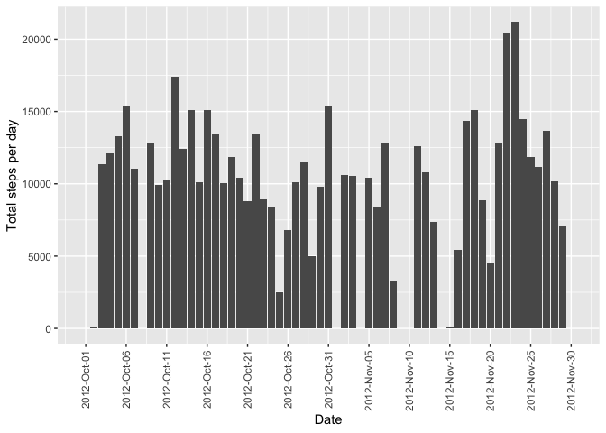
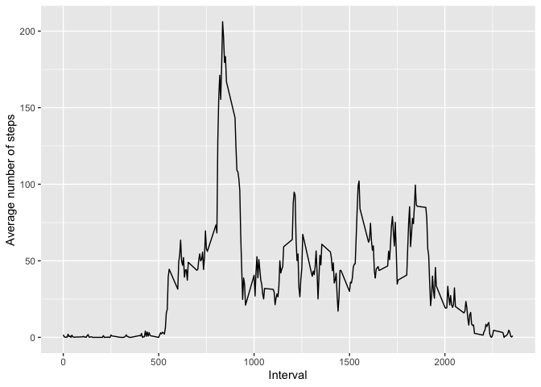
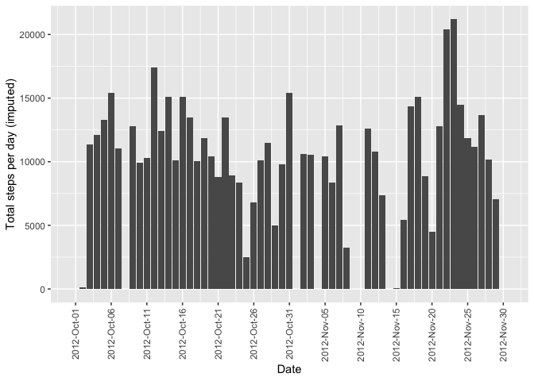
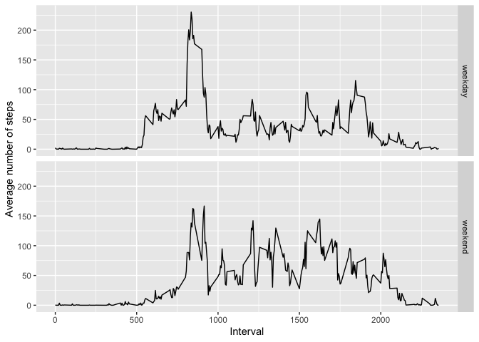

## load packages

```r
library(ggplot2)
library(scales)
library(impute)
```

## Loading and preprocessing the data

```r
df <- read.table(unz("activity.zip", "activity.csv"), header=T, sep=",")
df$date<-as.Date(df$date)
summary(df)
```

```
##      steps             date               interval     
##  Min.   :  0.00   Min.   :2012-10-01   Min.   :   0.0  
##  1st Qu.:  0.00   1st Qu.:2012-10-16   1st Qu.: 588.8  
##  Median :  0.00   Median :2012-10-31   Median :1177.5  
##  Mean   : 37.38   Mean   :2012-10-31   Mean   :1177.5  
##  3rd Qu.: 12.00   3rd Qu.:2012-11-15   3rd Qu.:1766.2  
##  Max.   :806.00   Max.   :2012-11-30   Max.   :2355.0  
##  NA's   :2304
```

## What is mean total number of steps taken per day?
1. Make a histogram of the total number of steps taken each day

```r
# generate data for total steps
sum_per_day<-with(df,tapply(steps,date,sum,na.rm=TRUE))
total_steps<-data.frame(TotalSteps=sum_per_day,date=as.Date(names(sum_per_day)))
# histogram
ggplot(total_steps, aes(x=date, y=sum_per_day)) + geom_bar(stat="identity")+
        scale_x_date(labels = date_format("%Y-%b-%d"),
                     breaks = seq(min(total_steps$date), max(total_steps$date), 5))+
        xlab("Date") + ylab("Total steps per day") +
        theme(axis.text.x = element_text(angle = 90, vjust = 0.5, hjust=1))
```

<!-- -->

2. Calculate and report the mean and median total number of steps taken per day

```r
mn<-format(round(mean(sum_per_day),2),big.mark = ',')
md<-format(median(sum_per_day),big.mark = ',')
```
The mean total number of steps taken per day is **9,354.23**.
The median total number of steps taken per day is **10,395**.

## What is the average daily activity pattern?
1. Make a time series plot (i.e. type = "l") of the 5-minute interval (x-axis) and the average number of steps taken, averaged across all days (y-axis)

```r
# generate data for average daily activity
df_int<-split(df,df$interval)
aver_per_int<-sapply(df_int,function(x) mean(x[,1],na.rm=TRUE))
average_steps<-data.frame(AverSteps=aver_per_int,interval=as.numeric(names(aver_per_int)))
# plot
ggplot(average_steps, aes(x=interval,y=AverSteps))+geom_line()+
        xlab("Interval") + ylab("Average number of steps")
```

<!-- -->

2. Which 5-minute interval, on average across all the days in the dataset, contains the maximum number of steps?

```r
mx<-max(average_steps$AverSteps)
int_mx<-average_steps$interval[which(average_steps$AverSteps==mx)]
```
On average across all the days in the dataset, interval **835** contains the maximum number of steps 

## Imputing missing values
1.Calculate and report the total number of missing values in the dataset (i.e. the total number of rows with NAs)

```r
df$IsNA<-apply(df[,1:3],1,function(x) any(is.na(x)))
nas<-format(sum(df$IsNA),big.mark = ',')
```
There are **2,304** rows with NAs in the dataset.

2.Devise a strategy for filling in all of the missing values in the dataset. The strategy does not need to be sophisticated. For example, you could use the mean/median for that day, or the mean for that 5-minute interval, etc.

```r
# fill the missing values with the mean of the 5-minute interval
df$steps_impu<-df$steps
for (i in average_steps$interval){
        df$steps_impu[which(is.na(df$steps)&df$interval==i)]<-average_steps$AverSteps[which(average_steps$interval==i)]}
```

3.Create a new dataset that is equal to the original dataset but with the missing data filled in.

```r
df_impu<-df[,c('steps_impu','date','interval')]
names(df_impu)[1]<-'steps'
summary(df_impu)
```

```
##      steps             date               interval     
##  Min.   :  0.00   Min.   :2012-10-01   Min.   :   0.0  
##  1st Qu.:  0.00   1st Qu.:2012-10-16   1st Qu.: 588.8  
##  Median :  0.00   Median :2012-10-31   Median :1177.5  
##  Mean   : 37.38   Mean   :2012-10-31   Mean   :1177.5  
##  3rd Qu.: 27.00   3rd Qu.:2012-11-15   3rd Qu.:1766.2  
##  Max.   :806.00   Max.   :2012-11-30   Max.   :2355.0
```

4.Make a histogram of the total number of steps taken each day and Calculate and report the mean and median total number of steps taken per day. Do these values differ from the estimates from the first part of the assignment? What is the impact of imputing missing data on the estimates of the total daily number of steps?

```r
## histogram
sum_per_day_impu<-with(df_impu,tapply(steps,date,sum,na.rm=TRUE))
total_steps_impu<-data.frame(TotalSteps=sum_per_day_impu,date=as.Date(names(sum_per_day_impu)))
ggplot(total_steps_impu, aes(x=date, y=sum_per_day)) + geom_bar(stat="identity")+
        scale_x_date(labels = date_format("%Y-%b-%d"),
                     breaks = seq(min(total_steps$date), max(total_steps$date), 5))+
        xlab("Date") + ylab("Total steps per day (imputed)") +
        theme(axis.text.x = element_text(angle = 90, vjust = 0.5, hjust=1))
```

<!-- -->

```r
## mean and median for the imputed data
mn1<-format(mean(sum_per_day_impu),big.mark=',')
md1<-format(median(sum_per_day_impu),big.mark=',')
```
The mean total number of steps taken per day is **9,354.23** for the raw data and **10,766.19** for the imputed data.  
The median total number of steps taken per day is **10,395** for the raw data and **10,766.19** for the imputed data.  
**Conclusion**: imputing missing data makes the mean and median of the total daily number of steps larger.

## Are there differences in activity patterns between weekdays and weekends?
1.Create a new factor variable in the dataset with two levels -- "weekday" and "weekend" indicating whether a given date is a weekday or weekend day.

```r
df_impu$week<-ifelse(weekdays(df_impu$date) %in% c('Saturday','Sunday'),1,0)
df_impu$week<-as.factor(df_impu$week)
levels(df_impu$week)<-c('weekday', 'weekend')
```

2.Make a panel plot containing a time series plot (i.e. type = "l") of the 5-minute interval (x-axis) and the average number of steps taken, averaged across all weekday days or weekend days (y-axis). The plot should look something like the following, which was created using simulated data:

```r
# generate data for average daily activity
df_week<-split(df_impu,df_impu$week)
df_weekday<-split(df_week$weekday,df_week$weekday$interval)
aver_weekday<-sapply(df_weekday,function(x) mean(x[,1],na.rm=TRUE))
df_weekend<-split(df_week$weekend,df_week$weekend$interval)
aver_weekend<-sapply(df_weekend,function(x) mean(x[,1],na.rm=TRUE))
dfc<-data.frame(AverSteps=c(aver_weekday,aver_weekend),
                interval=as.numeric(c(names(aver_weekday),names(aver_weekend))),
                week=factor(rep(c('weekday','weekend'),each=length(aver_weekday))))
# plot
ggplot(dfc, aes(x=interval,y=AverSteps))+geom_line()+ facet_grid(week ~ .)+
        xlab("Interval") + ylab("Average number of steps")
```

<!-- -->

**Conclusion**: yes, differences in activity patterns between weekdays and weekends could be observed according to the panel plot.

